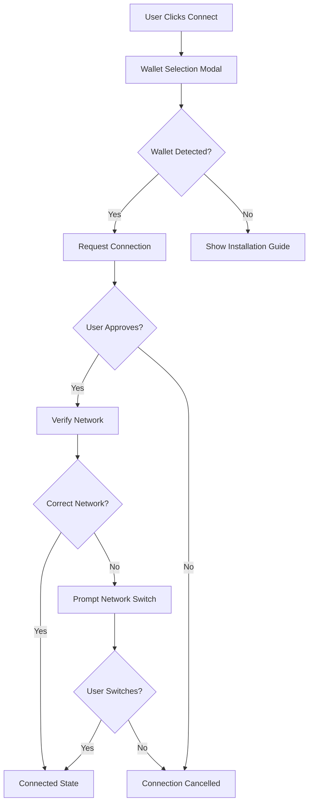
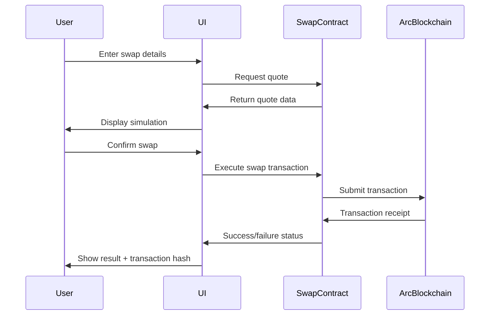
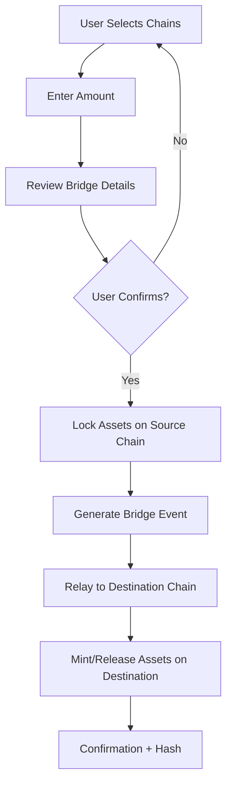
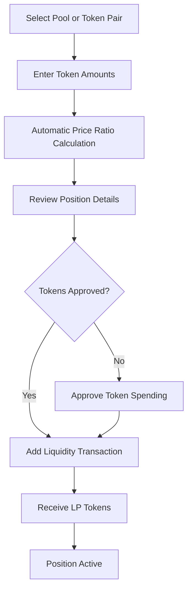
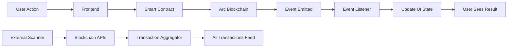

# Stac - Home of DeFi on Arc

## Project Overview

**Name:** Stac  
**Tagline:** Home of DeFi on Arc  
**Network:** Arc Testnet (EVM-compatible)  
**Type:** Decentralized Application (dApp)  
**Architecture:** Uniswap + Relay.link inspired DeFi platform

Stac is an AI-powered decentralized finance platform built on Arc Network, combining token swapping, cross-chain bridging, and liquidity provision capabilities. The platform leverages Arc's enterprise-grade infrastructure with predictable fiat-based fees (USDC as gas), sub-second finality, and EVM compatibility to deliver a seamless DeFi experience.

---

## Design Philosophy

### Visual Identity
- **Primary Theme:** Blue and white color blend
- **Design Language:** Modern, clean, minimalist (inspired by Relay.link)
- **Responsiveness:** Full responsive design across all screen sizes (mobile, tablet, desktop)
- **Mode Support:** Light and dark mode with smooth transitions
- **Animations:** Enhanced micro-interactions and smooth transitions for improved UX

### User Experience Principles
- Intuitive navigation with clear visual hierarchy
- Real-time data updates without page refresh
- Progressive disclosure of advanced features
- Persistent transaction history across sessions
- Multi-language support for global accessibility

---

## Core Features

### 1. Homepage

**Purpose:** Landing page showcasing platform statistics and ecosystem health

**Key Components:**

| Component | Description | Data Source |
|-----------|-------------|-------------|
| Hero Section | Welcome banner with tagline "Home of DeFi on Arc" | Static |
| Live Statistics Dashboard | Real-time platform metrics | Arc Testnet API + Internal Analytics |
| Quick Action Cards | Fast access to Swap, Bridge, Liquidity features | Navigation shortcuts |
| Recent Activity Feed | Latest platform transactions | Arc Testnet blockchain data |

**Statistics Displayed:**

- **24h Trading Volume:** Total value of swaps executed
- **Total Value Locked (TVL):** Aggregate liquidity across all pools
- **Active Users:** Unique wallet addresses interacting with platform
- **Transaction Count:** Total number of completed operations
- **Cross-chain Volume:** Bridge transaction volume
- **Average Gas Fees:** Current network fee metrics (in USDC)

**Initial State:** Dummy placeholder statistics that transition to live data upon blockchain connection

**Layout Pattern:**
- Full-width hero section with gradient background (blue-to-white blend)
- 2x2 or 4x1 grid for statistics cards (responsive)
- Animated counters for numerical values
- Trend indicators (up/down arrows with percentage change)

---

### 2. Wallet Integration

**Objective:** Support multiple wallet providers with secure connection handling

**Supported Wallets:**

| Wallet | Protocol | Priority |
|--------|----------|----------|
| MetaMask | Browser Extension/Mobile | High |
| WalletConnect | Protocol v2 | High |
| Coinbase Wallet | Browser Extension/Mobile | Medium |
| Rabby | Browser Extension | Medium |

**Connection Flow:**

**Network Configuration:**

- **Primary Network:** Arc Testnet
- **Supported Networks:** Arc Testnet, Ethereum Sepolia
- **Automatic Network Detection:** Verify chain ID upon connection
- **Network Switching:** Prompt user to switch if on unsupported network

**Connection State Management:**

- **Disconnected:** Show "Connect Wallet" button
- **Connecting:** Loading indicator with animation
- **Connected:** Display abbreviated address (0x1234...5678) or ENS name
- **Error States:** Clear error messages for common issues (wallet locked, wrong network, rejected connection)

**Security Considerations:**

- Validate wallet provider before connection attempt
- Never request private keys or seed phrases
- Implement connection timeout (30 seconds)
- Session persistence using secure local storage
- Auto-disconnect on network mismatch

**User Profile Display (When Connected):**

- Wallet address (abbreviated or ENS name)
- Current network indicator
- Native token balance (ETH on Arc Testnet)
- Refresh balance button
- Disconnect option
- Network switcher

---

### 3. Swap Feature

**Purpose:** Enable token-to-token exchanges on Arc Testnet with optimal routing

**User Interface Components:**

| Element | Function | Validation |
|---------|----------|------------|
| From Token Selector | Choose input token | Must have balance |
| From Amount Input | Enter swap quantity | Numeric, max balance check |
| To Token Selector | Choose output token | Cannot match input token |
| Switch Tokens Button | Swap from/to positions | Reverses token selection |
| To Amount Display | Show expected output | Auto-calculated from quote |
| Slippage Settings | Configure tolerance | 0.1% - 50% range |
| Swap Button | Execute transaction | Conditional on validation |

**Token Support:**
- ETH (Native Arc token)
- USDC (Stablecoin gas token on Arc)
- USDT, DAI, WBTC
- Extensible token list from Arc ecosystem

**Swap Quote Simulation:**

Before transaction execution, display comprehensive quote information:

- **Expected Output:** Estimated tokens to receive
- **Minimum Received:** Guaranteed minimum accounting for slippage
- **Price Impact:** Percentage effect on pool price
- **Exchange Rate:** Token conversion ratio
- **Route Visualization:** Token path through liquidity pools
- **Trading Fee:** Protocol fee breakdown (percentage and absolute value)
- **Gas Estimate:** Transaction cost in USDC

**Routing Logic:**

The system determines optimal swap path through available liquidity pools:
- Direct pair swap (if pool exists)
- Multi-hop routing through intermediate tokens
- Route optimization for lowest price impact
- Route visualization showing token path (e.g., ETH → WETH → USDC)

**Slippage Settings:**

| Preset | Use Case |
|--------|----------|
| 0.1% | Stable pairs (USDC/USDT) |
| 0.5% | Standard swaps |
| 1.0% | Volatile assets |
| Custom | User-defined tolerance |

**Balance Display:**

When wallet connected:
- Show available balance for selected input token
- "Max" button to use full balance (minus gas reserve)
- Real-time balance updates
- Insufficient balance warning

**Swap Execution Flow:**

**Transaction States:**

- **Idle:** Awaiting user input
- **Fetching Quote:** Loading simulation data
- **Ready:** Quote available, can execute
- **Pending:** Transaction submitted to blockchain
- **Confirming:** Awaiting block confirmation
- **Success:** Swap completed
- **Failed:** Transaction reverted with reason

---

### 4. Bridge Feature

**Purpose:** Enable secure cross-chain asset transfers between Ethereum Sepolia and Arc Testnet

**Supported Routes:**

| Source Chain | Destination Chain | Supported Assets |
|--------------|-------------------|------------------|
| Ethereum Sepolia | Arc Testnet | ETH, USDC, USDT, DAI |
| Arc Testnet | Ethereum Sepolia | ETH, USDC, USDT, DAI |

**Bridge Interface Components:**

- **Source Chain Selector:** Dropdown for origin blockchain
- **Destination Chain Selector:** Dropdown for target blockchain
- **Chain Swap Button:** Icon in middle to reverse source/destination
- **Token Selector:** Choose asset to bridge
- **Amount Input:** Quantity to transfer
- **Estimated Arrival Time:** Expected completion duration
- **Bridge Fee Display:** Cost breakdown
- **Recipient Address:** Optional custom destination address (defaults to connected wallet)

**Chain Swap Functionality:**

The middle icon button allows users to instantly reverse the bridge direction:
- Swaps source and destination chains
- Maintains selected token if supported on both chains
- Resets amount input
- Updates fee estimates

**Bridge Process:**

**Security Measures:**

- **Lock-and-Mint Mechanism:** Assets locked on source, minted on destination
- **Multi-Signature Validation:** Require validator consensus for large transfers
- **Transfer Limits:** Daily/per-transaction caps to mitigate risk
- **Audit Trail:** Full event logging for all bridge operations
- **Timeout Handling:** Automatic refund if bridge fails within timeout period
- **Reentrancy Protection:** Guard against recursive call attacks
- **Allowlist Verification:** Validate destination addresses
- **Circuit Breaker:** Emergency pause mechanism for detected anomalies

**Integration Approach:**

Leverage Circle's Cross-Chain Transfer Protocol (CCTP) for USDC bridges:
- Native USDC support on Arc Network
- Atomic bridge transactions
- No wrapped token intermediaries for USDC

For other assets (ETH, USDT, DAI):
- Custom bridge contract with lock-and-mint pattern
- Wrapped token representations on destination chain
- Validator-based consensus for unlock operations

**Fee Structure:**

- **Bridge Fee:** Flat percentage (e.g., 0.1%) of bridged amount
- **Gas Fees:** Paid on both source and destination chains
  - Source: Standard network gas
  - Destination: Covered by bridge protocol or paid in bridged asset
- **Fee Display:** Clear breakdown before confirmation

**Estimated Transfer Times:**

- Ethereum Sepolia → Arc Testnet: ~2-5 minutes
- Arc Testnet → Ethereum Sepolia: ~2-5 minutes
- Factors: Block confirmation requirements, validator response time

---

### 5. Liquidity Pool

**Purpose:** Enable users to provide liquidity and earn trading fees

**Pool Interface Design:**

Inspired by Uniswap v3 positions page with advanced features:

- **My Positions Overview:** Cards displaying active LP positions
- **Pool Browser:** Explore available liquidity pools
- **Add Liquidity Form:** Interface for depositing token pairs
- **Remove Liquidity:** Withdraw from existing positions
- **Position Analytics:** Performance metrics per position

**Pool Types:**

| Pool Type | Description | Use Case |
|-----------|-------------|----------|
| Standard AMM | Constant product (x*y=k) | General token pairs |
| Stable Pools | Low slippage for similar assets | USDC/USDT, DAI/USDC |
| Concentrated Liquidity | Price range-based positions | Advanced users, capital efficiency |

**Add Liquidity Flow:**

**Position Information Display:**

For each liquidity position:

- **Pool Pair:** Token symbols and icons (e.g., ETH/USDC)
- **Liquidity Amount:** Value in USD
- **Position Share:** Percentage of total pool
- **Fees Earned:** Unclaimed trading fees
- **Pool APR:** Estimated annual percentage return
- **Price Range:** For concentrated liquidity positions
- **In-Range Status:** Whether current price is within range
- **Impermanent Loss:** Estimated IL compared to holding

**Portfolio Integration:**

The portfolio page reads all tokens in connected wallet:

- **Token Discovery:** Scan wallet for all ERC-20 tokens
- **Balance Aggregation:** Show quantity and USD value
- **Total Portfolio Value:** Sum of all assets
- **Asset Allocation Chart:** Visual breakdown by token
- **Price Change Indicators:** 24h performance per token
- **Refresh Functionality:** Manual update trigger

**Portfolio Display Structure:**

| Token | Balance | USD Value | 24h Change | Actions |
|-------|---------|-----------|------------|---------|
| ETH | 5.234 | $10,468.00 | +2.3% | Swap, Bridge, Add LP |
| USDC | 2,500.00 | $2,500.00 | 0.0% | Swap, Bridge, Add LP |

**Remove Liquidity:**

- Select position to withdraw
- Choose percentage to remove (0-100%)
- Display expected token amounts to receive
- Show remaining position value after removal
- Claim accrued fees simultaneously

---

### 6. Transactions Tab

**Purpose:** Comprehensive transaction history with real-time updates

**Tab Structure:**

| Sub-Tab | Content | Data Source |
|---------|---------|-------------|
| My Transactions | User's personal transaction history | Wallet address filtered blockchain queries |
| All Transactions | Platform-wide transaction feed | Arc Testnet and Sepolia blockchain explorers |

**Transaction Data Integration:**

**For "My Transactions":**
- Query Arc Testnet blockchain for transactions involving connected wallet
- Query Ethereum Sepolia for bridge transactions
- Filter by transaction types: Swap, Bridge, Add Liquidity, Remove Liquidity
- Real-time updates using blockchain event listeners

**For "All Transactions":**
- Aggregate real-time transactions from:
  - Arc Testnet: https://testnet.arcscan.app/ API
  - Ethereum Sepolia: https://sepolia.etherscan.io/ API
- Display all Stac-related transactions across platform
- Live feed with WebSocket or polling mechanism

**Transaction Display Fields:**

| Field | Description | Format |
|-------|-------------|--------|
| Type | Operation category | Icon + label (Swap, Bridge, LP) |
| From | Source token/chain | Token symbol or chain name |
| To | Destination token/chain | Token symbol or chain name |
| Amount | Quantity transferred | Numeric with token symbol |
| Timestamp | Transaction time | Relative (2m ago) or absolute (2024-11-15 10:30) |
| Status | Current state | Success, Pending, Failed with icon |
| Transaction Hash | Blockchain identifier | Truncated with copy button |
| Address | Wallet involved | Truncated address for All Transactions |

**Transaction Persistence:**

- **Storage Mechanism:** Browser local storage or IndexedDB
- **Retention:** Indefinite local storage
- **Refresh Behavior:** Transactions persist across page refreshes
- **Sync Strategy:** On wallet connect, sync with blockchain to update statuses

**Real-Time Updates:**

- WebSocket connection to blockchain nodes for instant updates
- Polling fallback every 15 seconds if WebSocket unavailable
- Visual notification for new transactions (toast message)
- Auto-refresh transaction status from Pending to Confirmed

**Transaction Detail View:**

Clicking a transaction hash opens detailed modal:

- Full transaction hash (copyable)
- Block number and confirmation count
- Gas used and gas price
- Input data
- Event logs
- Link to block explorer (ArcScan or Etherscan)

**Filtering and Search:**

- Filter by transaction type (Swap, Bridge, Add LP, Remove LP)
- Filter by status (Success, Pending, Failed)
- Date range selector
- Search by transaction hash or token symbol

---

## Technical Architecture

### Frontend Technology Stack

| Layer | Technology | Purpose |
|-------|------------|---------|
| Framework | React 18+ | Component-based UI |
| Styling | Tailwind CSS / Styled Components | Responsive design system |
| State Management | React Context / Redux | Global state handling |
| Wallet Integration | Web3.js / Ethers.js | Blockchain interaction |
| Multi-Wallet Support | RainbowKit / Web3Modal | Wallet connection abstraction |
| Internationalization | react-i18next | Multi-language support |
| Charts & Analytics | Chart.js / Recharts | Data visualization |
| Animations | Framer Motion | Smooth UI transitions |

### Smart Contract Architecture

**Contract Categories:**

1. **Swap Contracts**
   - Router contract for optimal path finding
   - Pair contracts for liquidity pools
   - Factory contract for pool creation
   - Quote contract for price simulation

2. **Bridge Contracts**
   - Lock contract on source chain
   - Mint contract on destination chain
   - Validator registry and consensus mechanism
   - Event relay and verification system

3. **Liquidity Contracts**
   - Pool management contracts
   - LP token minting/burning
   - Fee distribution logic
   - Position tracking contracts (for concentrated liquidity)

4. **Governance & Admin**
   - Fee management contracts
   - Emergency pause mechanisms
   - Parameter update contracts
   - Timelock for critical changes

**Contract Security Measures:**

- Reentrancy guards on all state-changing functions
- Access control (roles-based permissions)
- Pausable functionality for emergency stops
- Input validation and sanitization
- Integer overflow/underflow protection (Solidity 0.8+)
- External call failure handling
- Front-running mitigation strategies
- Audit by reputable security firms before mainnet

### Blockchain Interaction

**Arc Testnet Integration:**

- **RPC Endpoint:** Official Arc Testnet RPC URL
- **Chain ID:** Arc Testnet specific chain identifier
- **Gas Token:** USDC (predictable fiat-based fees)
- **Block Time:** Sub-second finality (<1 second)
- **Contract Deployment:** Standard EVM deployment process

**Ethereum Sepolia Integration:**

- **RPC Endpoint:** Public Sepolia RPC providers
- **Chain ID:** 11155111 (Sepolia)
- **Gas Token:** SepoliaETH
- **Block Time:** ~12 seconds
- **Contract Deployment:** Standard deployment

**API Integration:**

- Arc Testnet Explorer API for transaction data
- Etherscan API for Sepolia transaction data
- Token price feeds (Chainlink oracles or DEX aggregators)
- ENS resolution for Ethereum addresses

---

## Security Strategy

### Smart Contract Security

**Development Best Practices:**

- Follow OpenZeppelin contract standards and libraries
- Implement comprehensive unit tests (>95% coverage)
- Integration tests for cross-contract interactions
- Formal verification for critical functions
- Static analysis tools (Slither, Mythril)
- External security audits before deployment

**Runtime Security:**

- Multi-signature requirements for admin functions
- Timelock delays for parameter changes
- Circuit breaker pattern for emergency pauses
- Rate limiting on high-value operations
- Whitelist/blacklist capabilities for regulatory compliance

**Vulnerability Mitigation:**

| Threat | Mitigation |
|--------|------------|
| Reentrancy | Checks-Effects-Interactions pattern, ReentrancyGuard |
| Front-running | Commit-reveal schemes, batch processing |
| Flash loan attacks | Time-weighted price oracles, minimum liquidity requirements |
| Price manipulation | Multi-source price feeds, circuit breakers |
| Sandwich attacks | Slippage protection, MEV protection services |
| Approval exploits | Limited approvals, approval revocation UI |

### Frontend Security

**Input Validation:**

- Sanitize all user inputs (amounts, addresses, custom parameters)
- Numeric validation with decimal precision limits
- Address validation (checksum verification)
- Amount bounds checking (minimum/maximum limits)
- Prevention of negative values and scientific notation exploits

**Connection Security:**

- Never request or display private keys
- Secure session management
- Timeout inactive connections
- Clear wallet state on disconnect
- Verify contract addresses before interaction

**Data Security:**

- HTTPS-only communication
- Content Security Policy (CSP) headers
- XSS protection through input sanitization
- CSRF protection for state-changing operations
- Secure storage practices (avoid storing sensitive data)

### Bridge Security

**Cross-Chain Validation:**

- Multi-validator consensus (minimum 2/3 agreement)
- Independent event verification
- Merkle proof validation for cross-chain messages
- Replay attack prevention (nonce tracking)
- Fraud proof mechanisms

**Transfer Limits:**

- Daily bridge volume caps
- Per-transaction maximum amounts
- Gradual limit increases for new routes
- Emergency shutdown capability

---

## Internationalization (i18n)

### Supported Languages

| Language | Code | Target Users |
|----------|------|--------------|
| English | en | Global default |
| Spanish | es | Latin America, Spain |
| Chinese (Simplified) | zh | China, Southeast Asia |
| French | fr | France, Africa |

**Extensibility:** Architecture supports adding additional languages through JSON translation files

### Implementation Strategy

**Translation Coverage:**

- All UI labels and buttons
- Error messages and notifications
- Transaction status messages
- Help text and tooltips
- Email notifications (if implemented)

**Language Switching:**

- Language selector in header/settings
- Flag icons for visual identification
- Persist user preference in local storage
- Auto-detect browser language on first visit
- RTL support consideration for future languages (Arabic, Hebrew)

**Translation Structure:**

Organize translations by feature module:
- Common (navigation, buttons, errors)
- Home (statistics, hero content)
- Swap (form labels, messages)
- Bridge (chain names, confirmation text)
- Liquidity (pool terms, analytics)
- Transactions (status labels, columns)

---

## Responsive Design

### Breakpoint Strategy

| Device | Breakpoint | Layout Adjustments |
|--------|------------|-------------------|
| Mobile | < 640px | Single column, stacked cards, hamburger menu |
| Tablet | 640px - 1024px | Two-column grid, collapsible sidebar |
| Desktop | > 1024px | Full multi-column layout, persistent sidebar |

### Mobile Optimizations

**Navigation:**
- Hamburger menu for main navigation
- Bottom navigation bar for quick actions
- Swipe gestures for tab switching

**Forms:**
- Full-width inputs on mobile
- Larger touch targets (minimum 44x44px)
- Native number keyboards for amount inputs
- Simplified multi-step flows

**Tables:**
- Horizontal scroll for transaction tables
- Card view alternative for complex data
- Collapsible rows for detailed information

**Modals:**
- Full-screen modals on mobile
- Slide-up animations
- Easy dismiss gestures

---

## User Experience Enhancements

### Animations and Transitions

**Micro-interactions:**

- Button hover states with subtle scale/shadow effects
- Loading skeletons for data fetching
- Smooth page transitions
- Toast notifications sliding in from top-right
- Number counters animating on stat changes
- Progress indicators for multi-step processes

**Theme Transitions:**

- Smooth color transitions when switching between light/dark mode
- Maintain WCAG AA contrast ratios in both modes
- Persist theme preference in local storage

**Transaction Feedback:**

- Pending transaction pulsing animation
- Success checkmark animation
- Failure shake animation
- Confetti effect for large successful swaps (optional, toggleable)

### Error Handling

**User-Friendly Messages:**

| Error Type | User Message | Action |
|------------|--------------|--------|
| Insufficient Balance | "Insufficient [TOKEN] balance. You have [AMOUNT]." | Show balance, suggest reducing amount |
| Network Error | "Unable to connect to Arc Network. Check your connection." | Retry button |
| Transaction Failed | "Transaction failed: [REASON]. Please try again." | Link to help docs |
| Slippage Exceeded | "Price changed beyond your slippage tolerance." | Increase slippage or retry |
| Rejected by User | "Transaction cancelled." | Return to form |

**Error Recovery:**

- Automatic retry for network failures (with exponential backoff)
- Clear call-to-action buttons
- Link to help documentation or support
- Transaction history preservation even on error

### Loading States

- Skeleton screens while fetching data
- Progress bars for multi-step operations
- Disable buttons during processing
- Clear "Processing..." messages
- Estimated time remaining for long operations

---

## Data Flow Architecture

### Real-Time Data Synchronization

### State Management Strategy

**Global State:**
- Wallet connection status and address
- Current network and chain ID
- User balances for all tokens
- Theme preference (light/dark)
- Language preference
- Transaction history

**Component-Level State:**
- Form inputs and validation
- Loading states
- Error messages
- Modal visibility

**Derived State:**
- Calculated swap quotes
- Portfolio total value
- Position analytics
- Fee estimates

### Caching Strategy

**Blockchain Data:**
- Cache token balances (refresh every 30 seconds or on transaction)
- Cache pool information (refresh every 60 seconds)
- Cache price data (refresh every 15 seconds)

**User Data:**
- Persist transaction history in IndexedDB
- Cache wallet preferences in localStorage
- Session-based caching for quote simulations

---

## Smart Contract Functions

### Swap Contract Interface

**Core Functions:**

| Function Name | Purpose | Parameters | Returns |
|---------------|---------|------------|---------|
| swapExactTokensForTokens | Execute swap with exact input | amountIn, amountOutMin, path, to, deadline | amounts[] |
| swapTokensForExactTokens | Execute swap with exact output | amountOut, amountInMax, path, to, deadline | amounts[] |
| getAmountsOut | Simulate swap output | amountIn, path | amounts[] |
| addLiquidity | Deposit tokens to pool | tokenA, tokenB, amountA, amountB, minA, minB, to, deadline | amountA, amountB, liquidity |
| removeLiquidity | Withdraw from pool | tokenA, tokenB, liquidity, minA, minB, to, deadline | amountA, amountB |

**Events Emitted:**

- Swap(sender, amountIn, amountOut, path, to)
- LiquidityAdded(provider, tokenA, tokenB, amountA, amountB)
- LiquidityRemoved(provider, tokenA, tokenB, amountA, amountB)

### Bridge Contract Interface

**Core Functions:**

| Function Name | Purpose | Parameters | Returns |
|---------------|---------|------------|---------|
| lockAndBridge | Initiate bridge transfer | token, amount, destChain, recipient | bridgeId |
| relayAndMint | Complete bridge on destination | bridgeId, proof, signatures | success |
| claimRefund | Recover failed bridge assets | bridgeId | amount |
| getBridgeStatus | Check transfer progress | bridgeId | status |

**Events Emitted:**

- BridgeInitiated(bridgeId, token, amount, sourceChain, destChain, sender, recipient)
- BridgeCompleted(bridgeId, token, amount, recipient)
- BridgeFailed(bridgeId, reason)

### Security Functions

**Emergency Controls:**

- pause(): Halt all contract operations
- unpause(): Resume operations
- updateFee(newFee): Adjust protocol fees (timelock required)
- setValidator(address, bool): Manage validator set

---

## Testing Strategy

### Smart Contract Testing

**Unit Tests:**
- Test each function in isolation
- Edge case validation (zero amounts, maximum values)
- Access control verification
- Event emission validation

**Integration Tests:**
- Multi-contract interaction flows
- Cross-chain bridge simulation
- Liquidity provision and swap combinations
- Fee calculation accuracy

**Security Tests:**
- Reentrancy attack simulations
- Front-running scenarios
- Overflow/underflow attempts
- Unauthorized access attempts

**Test Networks:**
- Local Hardhat network for rapid testing
- Arc Testnet for integration testing
- Sepolia for cross-chain testing

### Frontend Testing

**Component Tests:**
- Form validation logic
- Wallet connection flows
- Transaction state management
- i18n translation rendering

**Integration Tests:**
- End-to-end user journeys (connect → swap → view transaction)
- Multi-wallet compatibility
- Network switching
- Error handling flows

**Browser Testing:**
- Chrome, Firefox, Safari, Edge compatibility
- Mobile browser testing (iOS Safari, Chrome Mobile)
- Responsive design validation

---

## Deployment Strategy

### Smart Contract Deployment

**Pre-Deployment:**
1. Complete security audit
2. Testnet deployment and verification
3. Community bug bounty program
4. Finalize contract parameters (fees, limits)

**Deployment Sequence:**
1. Deploy core utility contracts (libraries)
2. Deploy factory and router contracts
3. Initialize token pairs and liquidity pools
4. Deploy bridge contracts on both chains
5. Configure validator set
6. Transfer ownership to multi-sig wallet

**Post-Deployment:**
1. Verify contracts on block explorers
2. Publish ABI and contract addresses
3. Initial liquidity provision
4. Monitoring and alert systems

### Frontend Deployment

**Hosting:**
- Static hosting (Vercel, Netlify, AWS S3 + CloudFront)
- CDN for global distribution
- IPFS deployment for decentralization option

**Build Process:**
1. Environment-specific configuration (testnet/mainnet)
2. Production build optimization
3. Contract address injection
4. Asset optimization and minification

**Monitoring:**
- Error tracking (Sentry)
- Analytics (privacy-focused)
- Performance monitoring
- Uptime monitoring

---

## Performance Optimization

### Frontend Performance

**Load Time Optimization:**
- Code splitting by route
- Lazy loading for non-critical components
- Image optimization (WebP format, responsive images)
- Bundle size reduction (tree shaking, compression)

**Runtime Performance:**
- Memoization of expensive calculations
- Virtual scrolling for long transaction lists
- Debouncing for input handlers
- Web Workers for heavy computations

**Caching:**
- Service worker for offline capability
- Static asset caching
- API response caching with invalidation strategy

### Blockchain Interaction Optimization

**RPC Efficiency:**
- Batch RPC calls when possible
- Efficient event filtering
- Multicall contract for reading multiple values
- Fallback RPC providers for reliability

**Gas Optimization:**
- Estimate gas before transactions
- Allow user gas price adjustment
- Batch transactions where applicable
- Optimize contract code for gas efficiency

---

## Future Enhancements

### Potential Features

1. **AI-Powered Features:**
   - Optimal trade routing suggestions
   - Impermanent loss predictions
   - Portfolio rebalancing recommendations
   - Smart notification system

2. **Advanced Trading:**
   - Limit orders
   - Stop-loss functionality
   - Dollar-cost averaging (DCA) automation
   - Trading bots/strategies

3. **Social Features:**
   - Wallet following and copy trading
   - Leaderboards for top liquidity providers
   - Social sentiment integration

4. **Governance:**
   - DAO for platform decisions
   - Fee distribution voting
   - Protocol upgrade proposals

5. **Additional Chains:**
   - Expand bridge to more networks
   - Multi-chain liquidity aggregation

---

## Success Metrics

### Key Performance Indicators

| Metric | Target | Measurement |
|--------|--------|-------------|
| Total Value Locked (TVL) | $10M+ within 6 months | On-chain data |
| Daily Active Users | 1,000+ within 3 months | Unique wallet addresses |
| Transaction Volume | $1M+ daily within 6 months | Swap + bridge volume |
| Average Transaction Time | <5 seconds | User experience monitoring |
| Error Rate | <1% of transactions | Error tracking |
| User Retention | 40%+ monthly | Returning wallet addresses |

### User Satisfaction

- Net Promoter Score (NPS) target: >50
- Support ticket resolution time: <24 hours
- App store rating (if mobile): >4.5/5

---

## Glossary

| Term | Definition |
|------|------------|
| AMM | Automated Market Maker - algorithmic trading mechanism |
| Arc Network | EVM-compatible blockchain with USDC gas and sub-second finality |
| Bridge | Cross-chain asset transfer mechanism |
| Impermanent Loss | Temporary loss from providing liquidity vs. holding assets |
| Liquidity Pool | Smart contract holding token pairs for trading |
| LP Token | Liquidity Provider token representing pool share |
| Slippage | Price difference between expected and executed trade |
| TVL | Total Value Locked - total assets deposited in protocol |
| dApp | Decentralized Application - blockchain-based software |

---

## Appendix

### Arc Network Resources

- Documentation: https://docs.arc.network/arc/concepts/welcome-to-arc
- Testnet Explorer: https://testnet.arcscan.app/
- Developer Portal: Arc Network developer documentation
- Faucet: Arc Testnet token faucet

### External Dependencies

- Ethereum Sepolia Explorer: https://sepolia.etherscan.io/
- Circle CCTP: Cross-Chain Transfer Protocol for USDC
- OpenZeppelin Contracts: Security-audited smart contract libraries
- Chainlink: Price feeds and oracle services

### Design References

- Uniswap Interface: https://app.uniswap.org/
- Relay.link: Design and UX inspiration
- Material Design: Component patterns and accessibility guidelines